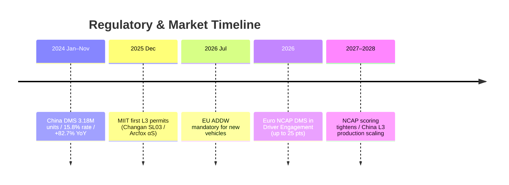
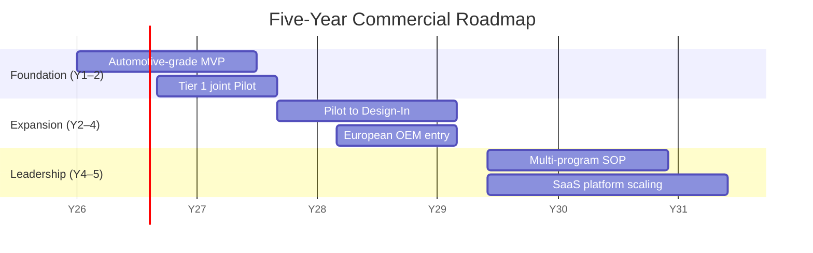

{.cover-banner}

# SentinelDMS Business Plan

**OmniDrive · SentinelDMS**

*A Next-Generation Driver Monitoring System Powered by Multimodal Vision-Language Models*

Project Lead: Feng Kai  ·  Team: HKU Graduate Team

Date: 2026

---

## 1. Executive Summary

SentinelDMS is a next-generation driver monitoring software (DMS) for the L3+ autonomous-driving era. We combine real-time CNN perception with vision-language models (VLM) in a Fast + Slow dual-system architecture: the Fast system (30 FPS, MediaPipe + YOLOv8) tracks eye and mouth physiological signals, while the Slow system (Qwen3-Omni VLM) emits a structured semantic assessment and recommended action every 2–3 seconds.

We target a global DMS market of US$5.5B by 2030 [1]. The EU ADDW mandate [2], the Euro NCAP 2026 scoring upgrade, and China's L3 admission standard [3] together create clear and regulation-backed demand. Our business model is dual-engine — Edge SDK licensing plus Cloud SaaS subscription — with 85%+ blended gross margin, LTV/CAC > 3, break-even in Year 3, and Year-5 revenue of US$10.5M.

This **HK$10M seed round** funds a 12-month delivery of an automotive-grade MVP and the first OEM design-in.

## 2. Problem & Opportunity

L3 autonomous driving requires the driver and vehicle to safely hand off control within seconds. Today's DMS solutions are constrained on five fronts: ① **fragmented multi-tasking** — distraction, drowsiness and emotion are detected by separate models, multiplying compute and latency; ② **black-box predictions** — CNNs cannot articulate their reasoning, creating challenges for regulatory compliance and auditability; ③ **data scarcity** — rare-behavior labeling is expensive and privacy-restricted; ④ **poor cross-domain generalization** — every new vehicle, lighting condition or driver demographic demands retraining; ⑤ **multi-task conflict** — the seesaw effect degrades joint-training accuracy.

These five bottlenecks point toward a single paradigm-level solution.

## 3. Market Analysis

- **TAM**: US$5.5B global DMS market by 2030 [1];
- **SAM**: US$1.65B for China + Europe passenger-car DMS;
- **SOM**: US$33M obtainable in Year 5 (~2% share).

**Regulatory drivers**: the EU ADDW regulation becomes mandatory for all new vehicle registrations from 7 July 2026; Euro NCAP 2026 places DMS in a new Driver Engagement category contributing up to 25 points [2]; China's L3 standard from 2026 onward requires takeover monitoring; the MIIT issued the first L3 pilot permits to Changan Deepal SL03 and BAIC Arcfox αS in December 2025 [3]. From January to November 2024, China's passenger-car DMS shipments reached 3.18M units — a 15.8% installation rate, +82.7% YoY [4].

## 4. Industry Landscape & Competitive Differentiation

Mainstream OEM solutions (Tesla, GM, Mercedes, Ford, BMW) remain anchored in the camera-plus-behavioral-model paradigm. CES headline suppliers (Seeing Machines, Smart Eye, Gentex, Continental) each have unique strengths, yet mass-production DMS solutions are still dominated by purpose-built vision models — VLM-based DMS has not emerged as a mature product paradigm. In academia, VLM-DM [5] reaches 97.3% multi-task accuracy on SAM-DD and DriveCLIP [6] reaches 93.39% on DMD; however, VLM in DMS is still an emerging research direction with limited coverage and essentially no production deployment [8].

**SentinelDMS's three differentiators**: ① zero-shot generalization (native to VLM); ② natural-language explainability (vs. black-box competitors); ③ prompt-level rapid adaptation to evolving assessment protocols (competitors typically require 6–12 months of retraining).

## 5. Technology & Product

We have delivered a working prototype together with a production-grade dark-theme cockpit HUD built from custom PyQt5 widgets.

*Figure 1 · Dual-system architecture: the cabin camera drives a Fast CNN path (MediaPipe + YOLOv8, 30 FPS reflex) and a Slow VLM path (Qwen-Omni, 2–3 s semantic reasoning) in parallel; a confidence-weighted fusion layer emits the risk score, natural-language brief and recommended action. The full engineering ROS topology is provided in Appendix A.*

**Fast system (30 FPS)**: MediaPipe Face Mesh extracts 468 facial landmarks; two YOLOv8 models detect eye open/closed and yawn states; PERCLOS, EAR, blink rate and microsleep counts are computed in real time.

**Slow system (~0.3–0.5 Hz)**: Qwen3.5-Omni-Flash is invoked via DashScope on 480-px JPEG inputs with an average warm latency of 2.4 s. The VLM emits a seven-dimension structured output: drowsiness level; distraction type (phone / eating / talking / looking-away / operating / other); anomaly description and severity; occlusion (mask / sunglasses / hat) impact factor; environmental context; overall risk (0–10); and a natural-language explanation with a recommended action (none / verbal warning / alarm / pull-over).

**Decision fusion**: only the drowsiness dimension is fused via confidence-weighted linear combination (high fast-confidence → 0.8/0.2; low → 0.2/0.8); other dimensions pass through directly from the VLM, avoiding cross-contamination between Fast and Slow capabilities.

**Edge feasibility** [7]: MobileVLM 1.4B reaches 21.5 tokens/s on a Snapdragon 888 CPU; FastVLM-0.5B with INT8 quantization on a Snapdragon 8 Elite NPU achieves a time-to-first-token of 0.12 s with > 100 tokens/s decode; Mini-InternVL retains 90% of its larger model's performance using only 5% of the parameters. VLM edge deployment is now engineering-feasible.

|  |  |
|---|---|
| *Figure 2a · Normal driving: risk 1.0/10; the VLM reports "high level of alertness, no occlusions"* | *Figure 2b · Sunglasses occlusion: risk 5.0/10; the VLM autonomously detects "wearing dark sunglasses indoors", flags occlusion impact 7/10 and raises a SUNGLASSES anomaly* |

## 6. Performance Reference (Public Literature & Engineering Targets)

| Dimension | Public literature: CNN route [6] | Public literature: VLM route [5] | SentinelDMS Fusion target † |
|---|---|---|---|
| Drowsiness Acc. | 93.4% (DMD multi-frame) | 97.3% (SAM-DD) | ≥ 96% |
| Distraction recognition | Weak / unsupported | 97.3% | ≥ 95% |
| Mask occlusion F1 | Vision fails | Partial support | ≥ 85% |
| Night / low-light | Significant drop | Maintained | ≥ 90% |
| End-to-end latency | 33 ms / frame | 2.4 s warm | 33 ms fast + 2.4 s slow |
| FPS | 30 | 0.4 | 30 + 0.3–0.5 |
| False-alarm rate | High | Low | ≥ 50% lower expected |

† The two literature columns come from different datasets and task settings — **for reference only, not a strict benchmark comparison**. The Fusion column reflects engineering targets, to be validated in Pilot.

## 7. Business Model

**Dual engine**:

- **① Edge SDK licensing** — for OEMs and Tier 1 suppliers, US$200K–500K one-time NRE plus a US$3–8 per-vehicle royalty. Royalty gross margin ~90%; from Year 3 onward this becomes the primary revenue stream;
- **② Cloud SaaS platform** — US$2–5 per vehicle per year, including driving-behavior analytics, OTA model updates and customizable fleet dashboards. LTV/CAC = 3.75×.

The two streams are complementary: high-margin NRE provides early cash flow; royalty plus SaaS provide long-term predictable recurring revenue. Blended gross margin > 85%; customer LTV > US$15K; break-even Year 3; Year-5 revenue US$10.5M at 78% gross margin; cumulative 5-year revenue US$17.75M.

## 8. Target Customers & Sales Strategy

**Two initial segments**:

- **Tier 1**: Aptiv, Magna, Visteon, Mitsubishi Electric — established OEM channels, vehicle-platform integration capability and mass-production experience deliver the fastest path to product;
- **Innovation-driven EV OEMs**: NIO, XPeng, Zeekr — short decision cycles, aggressive ADAS / L3 investment and high willingness to adopt frontier AI.

**Sales path**: build a reference architecture jointly with Tier 1 → real-vehicle Pilots and public demos → secure design-in for next-generation programs, entering the royalty phase.

## 9. Marketing Strategy

The primary battlegrounds are **CES and AutoSens**, with an emphasis on live in-vehicle, scenario-based demos rather than slideware. Three core messages: ① robustness (stable where vision-only solutions fail); ② natural-language explanation (helping address explainability and audit needs); ③ regulatory adaptability (multi-protocol coverage across Euro NCAP / C-NCAP / NHTSA). We build trust through technical evidence rather than mass-market promotion.

## 10. Go-to-Market Roadmap

- **Y1–2 Foundation**: deliver the automotive-grade edge MVP; run Pilots with Tier 1; validate hardware performance;
- **Y2–4 Expansion**: convert Pilots into Design-Ins; engage European OEMs; build awareness through events and public evaluations;
- **Y4–5 Leadership**: support multiple production programs; expand to additional OEM platforms; establish leading-supplier status in next-generation DMS.

Path: **Pilot → Design-In → Production**.

*Figure 3 · Break-even in Y3, Year-5 revenue US$10.5M, cumulative 5-year revenue US$17.75M.*

## 11. Future Direction

**OMS + DMS integration** — extending driver monitoring to all-occupant monitoring unlocks personalized cabin features, child-presence detection, seatbelt monitoring and other value-added capabilities. **360° internal–external fusion** — a single perception model handles both cabin state and external road conditions, providing vehicle-level integrated input to the L3+ decision layer. Both directions align naturally with our VLM architecture.

## 12. Team

A team of HKU graduate students led by **Feng Kai** as project lead (CEO / Tech Lead). The team currently covers the required capability mix: system architecture and VLM model selection, real-time CNN pipelines with edge quantization, product definition and NCAP regulatory research, dataset processing and model evaluation, and automotive SoC porting with ONNX optimization.

Roles may evolve as the project enters the Pilot stage, but the core technical capabilities are already represented. Planned next-phase hires include automotive sales / BD and a senior automotive-embedded advisor.

## 13. Funding Plan

**Seed round HK$10M.** Within 12 months we will deliver: ① a stably running automotive-grade MVP on the edge platform; ② at least one Tier 1 joint Pilot; ③ the first OEM design-in. Use of funds: 60% R&D, 20% automotive adaptation and certification, 15% business development and events, 5% operations.

## 14. Key Assumptions & Risks

| Category | Key assumption | Risk | Mitigation |
|---|---|---|---|
| Per-vehicle pricing | SDK NRE $200K–500K + $3–8/unit royalty; SaaS $2–5/vehicle/year | OEM pricing pressure 30–50% | Modular pricing; high-margin SaaS as ballast |
| Volume | Y5 cumulative 600K–800K units (Tier 1 + 1–2 EV OEMs) | Production ramp delayed ≥ 12 months | Bridge with Pilot + SaaS cash flow |
| Pilot conversion | Pilot → Design-In ≈ 30% | Realistically 10–20% | Run 4–6 Pilots in parallel |
| Certification cycle | Euro NCAP adaptation 6–9 months | Mid-cycle scoring updates | Prompt-level generalization as moat |
| Sales cycle | Tier 1 design-in 12–18 months | May stretch to 24 months | EV OEM short-cycle wins for early revenue |
| Edge compute | Automotive NPU runs ≤ 1.5B VLM | Edge performance falls short | Real-time loop on-vehicle; cloud limited to model updates, fleet analytics, non-real-time review |

## 15. Conclusion

The DMS software market is a **regulation-driven, deterministically paced** track, and the next 12–24 months are the window for VLMs to establish technical differentiation. SentinelDMS combines a **validated prototype + regulatory alignment + dual-engine business model + complementary team** — a credible foundation to enter the market and scale. Multimodal VLMs represent DMS's paradigm shift from task-specific training to natural-language-guided learning, and we are positioned to become an early leader in this transition.

---

*This business plan is based on the SentinelDMS team's PPT and the delivered open-source prototype code (real-time-drowsy-driving-detection / drowsy-driving-vlm fork). All external facts were verified online in April 2026 and cited accordingly (see Appendix B); engineering targets in the † table and assumptions in the risk table are provided by the team and will be validated and revised during Pilot.*

## Appendix A · Engineering Implementation Detail {.appendix-section}

*Figure A1 · Prototype engineering topology: ROS nodes (mobile_sensor_node / multimodal_node / drowsiness_detector / dual_system_decision_maker), MediaPipe Face Mesh, dual YOLO heads, Qwen-Omni dual video/audio branches. For technical due-diligence and automotive integration reference only; **the headline architecture is in Figure 1 of the main text**.*

## Appendix B · References & Notes {.appendix-section}

[1] **DMS market size**: MarkNtel Advisors, $5.6B by 2030 (CAGR 12.5%); other firms range $2.94B–$8.10B (Research and Markets, Grand View Research, Future Market Insights). The plan adopts ~$5.5B as a midpoint estimate.
[2] **Euro NCAP 2026**: EU ADDW mandatory date 7 July 2026; the 2026 protocol restructures rating into Safe Driving / Crash Avoidance / Crash Protection / Post-Crash Safety, each scored out of 100; DMS contributes up to 25 points within Driver Engagement (Euro NCAP 2026 Protocols, ETSC, Smart Eye).
[3] **First Chinese L3 permits (Changan Deepal SL03 / BAIC Arcfox αS)**: MIIT, December 2025 — Changan capped at 50 km/h in Chongqing, Arcfox at 80 km/h in Beijing; both limited to congested highway / expressway scenarios (CnEVPost, Yicai Global, autoevolution, electrive).
[4] **China passenger-car DMS installation rate 15.8%, +82.7% YoY, 3.18M units (Jan–Nov 2024)**: ResearchInChina, *Automotive DMS/OMS Research Report 2024–2025* (distributed via Research and Markets / GlobeNewswire).
[5] **VLM-DM**: IEEE Xplore #11097620, IEEE IV 2025; ViT + Vicuna + LoRA + dynamic prompt tuning.
[6] **DriveCLIP**: Hasan et al., *Vision-Language Models Can Identify Distracted Driver Behavior From Naturalistic Videos*, IEEE T-ITS 25(9), 2024 (arXiv:2306.10159); "DriveCLIP" is the team's method name, first introduced at NeurIPS ML4AD 2022.
[7] **Edge inference**: MobileVLM 1.4B at 21.5 tokens/s on Snapdragon 888 CPU (arXiv:2312.16886); FastVLM-0.5B INT8 on Snapdragon 8 Elite NPU with TTFT 0.12 s and decode > 100 tokens/s (Apple HF + Google LiteRT); Mini-InternVL retains 90% performance with 5% parameters (arXiv:2410.16261).
[8] **VLM in DMS as an emerging direction**: qualitative support from recent surveys (Awesome-VLM-AD-ITS, arXiv:2503.12281); no authoritative quantitative breakdown of literature share exists; the original PPT's "<5%" figure is unverifiable and has been retracted.

