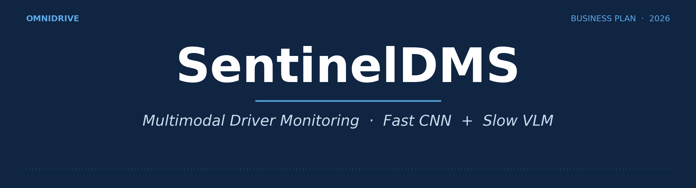
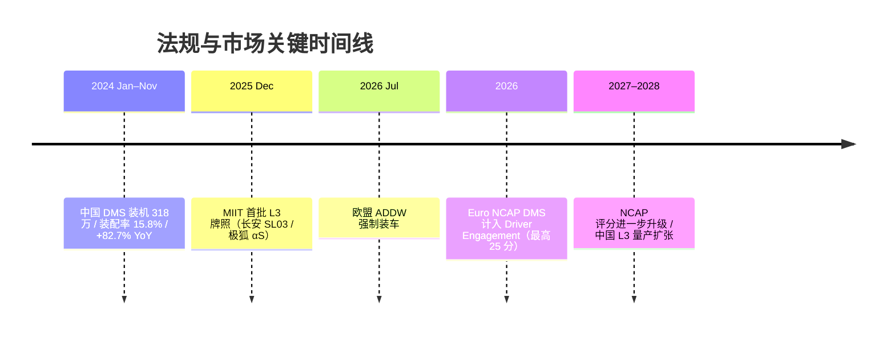
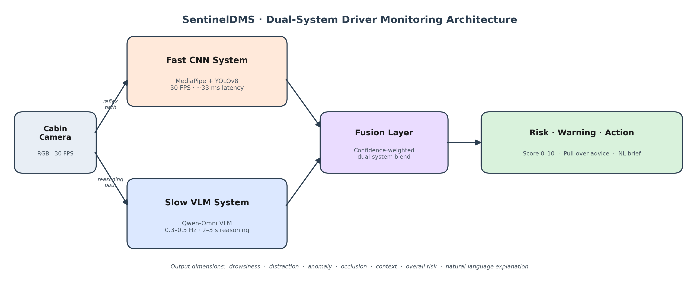
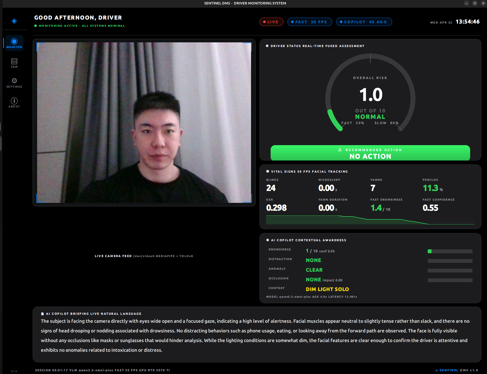
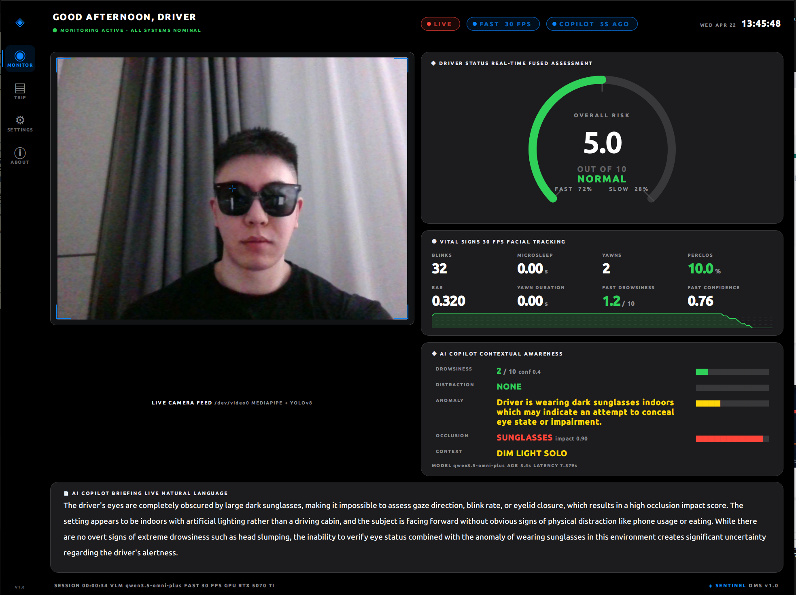
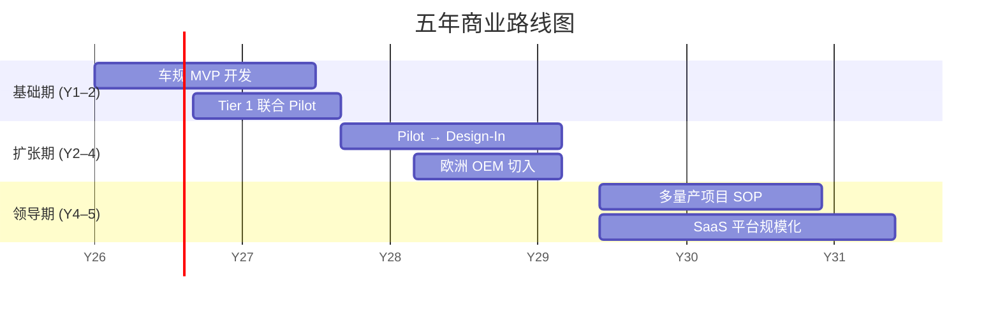
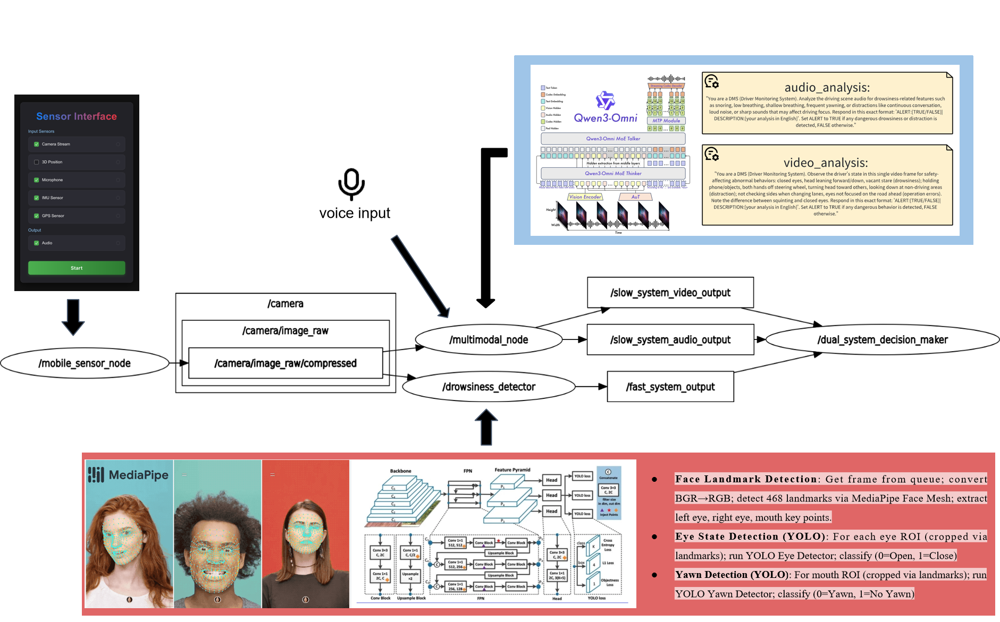

{.cover-banner}

# SentinelDMS 商业计划书

**OmniDrive · SentinelDMS**

*基于多模态视觉语言模型的下一代驾驶员监测系统*

项目负责人：冯凯  ·  团队：HKU 研究生团队

发布日期：2026 年

---

## 一、执行摘要

SentinelDMS 是面向 L3+ 自动驾驶时代的下一代驾驶员监测软件（DMS）。我们将 CNN 实时感知与视觉语言模型（VLM）结合，构建"快慢双系统"架构：快系统（30 FPS，MediaPipe + YOLOv8）追踪眼/嘴生理信号；慢系统（Qwen3-Omni VLM）每 2–3 秒输出一次结构化语义推理与处置建议。

我们瞄准 2030 年 55 亿美元的全球 DMS 市场[1]。欧盟 ADDW 强制装配[2]叠加 Euro NCAP 2026 评分升级与中国 L3 准入标准[3]，共同驱动确定性需求。商业模式采取"边缘 SDK 授权 + 云端 SaaS 订阅"双引擎：综合毛利 85%+，LTV/CAC > 3，第三年盈亏平衡，第五年收入 1050 万美元。

本轮**种子融资 1000 万港币**，12 个月交付车规级 MVP 并拿下首个 OEM 设计导入。

## 二、问题与机会

L3 级自动驾驶要求人车在数秒内安全交接控制权。当前 DMS 在五个维度集体受限：① **多任务割裂**——分心、疲劳、情绪由独立模型检测，算力与延迟叠加；② **黑箱不可解释**——CNN 无法输出判断依据，法规合规受阻；③ **数据稀缺**——稀有行为标注昂贵、隐私受限；④ **跨域泛化差**——换车型/光照/驾驶员均需重训；⑤ **多任务冲突**——"跷跷板效应"使联合训练精度下降。

五大瓶颈共同指向一个范式级解法。

## 三、市场分析

- **TAM**：2030 年全球 DMS 市场 55 亿美元[1]；
- **SAM**：中国 + 欧洲乘用车 DMS 16.5 亿美元；
- **SOM**：第 5 年可获 3300 万美元（约 2% 份额）。

**法规驱动**：欧盟 ADDW 法规 2026-07-07 起对所有新车强制；Euro NCAP 2026 协议将 DMS 纳入新设的 Driver Engagement 类别，单类最多贡献 25 分[2]；2026+ 中国 L3 标准要求接管监测；MIIT 已于 2025-12 向长安深蓝 SL03 与北汽极狐 αS 发放首批 L3 试点许可[3]。2024 年 1–11 月中国乘用车 DMS 装机量 318 万套、装配率 15.8%、同比 +82.7%[4]。

## 四、行业格局与竞争差异

主流 OEM 方案（Tesla、GM、Mercedes、Ford、BMW）仍以"摄像头 + 行为模型"为主。CES 头部供应商（Seeing Machines、Smart Eye、Gentex、Continental）各有所长，主流量产 DMS 公开方案仍以专用视觉模型为主，VLM-DMS 尚未形成成熟产品范式。学术界 VLM-DM[5]在 SAM-DD 上达 97.3% 多任务准确率，DriveCLIP[6]在 DMD 上达 93.39%；但 VLM 在 DMS 仍属新兴方向，研究覆盖有限、产品落地空白[8]。

**SentinelDMS 三大差异化**：① 零样本泛化（VLM 原生）；② 自然语言可解释（对手为黑箱）；③ Prompt 级即时适配新法规（对手需 6–12 个月重训）。

## 五、技术与产品

我们已交付可运行原型，并以 PyQt5 自绘组件构建产品级深色座舱 HUD。

*图 1 · 双系统架构：座舱摄像头同时驱动 Fast CNN 路径（MediaPipe + YOLOv8，30 FPS 反射）与 Slow VLM 路径（Qwen-Omni，2–3 秒语义推理）；置信度加权融合后输出风险分、自然语言简报与处置建议。完整工程级 ROS 拓扑详见附录 A。*

**快系统（30 FPS）**：MediaPipe Face Mesh 提取 468 关键点，YOLOv8 双模型分别检测眼开闭与哈欠，实时计算 PERCLOS、EAR、眨眼频率、微睡眠次数。

**慢系统（≈ 0.3–0.5 Hz）**：经 DashScope 调用 Qwen3.5-Omni-Flash，480 px JPEG 平均热延迟 2.4 秒。VLM 输出七维结构化结果：疲劳等级、分心类型（手机/进食/通话/视线偏离/操作/其他）、异常事件与严重度、遮挡（口罩/墨镜/帽子）影响系数、环境上下文、综合风险（0–10）、自然语言解释与处置建议（无/语音提醒/警报/靠边停车）。

**决策融合**：仅在疲劳维度做置信度线性加权（快置信高 → 0.8/0.2，快置信低 → 0.2/0.8）；其余维度 VLM 直出，避免快慢系统能力交叉污染。

**车端落地**[7]：MobileVLM 1.4B 在骁龙 888 CPU 达 21.5 token/s；FastVLM-0.5B 在骁龙 8 Elite NPU 经 INT8 量化后首字延迟 0.12 秒、解码 > 100 token/s；Mini-InternVL 系列以 5% 参数维持 90% 大模型性能——VLM 边缘部署已具工程可行性。

|  |  |
|---|---|
| *图 2a · 正常驾驶：风险 1.0/10，VLM 输出 "high level of alertness, no occlusions"* | *图 2b · 墨镜遮挡：风险 5.0/10，VLM 自动识别 "wearing dark sunglasses indoors"，遮挡置信度 7/10，给出 SUNGLASSES 异常标记* |

## 六、性能对照（公开文献参考与本方案工程目标）

| 维度 | 公开文献：CNN 路线 [6] | 公开文献：VLM 路线 [5] | SentinelDMS Fusion 工程目标 † |
|---|---|---|---|
| 疲劳 Acc. | 93.4%（DMD 多帧） | 97.3%（SAM-DD） | ≥ 96% |
| 分心识别 | 弱 / 不支持 | 97.3% | ≥ 95% |
| 口罩遮挡 F1 | 视觉失效 | 部分支持 | ≥ 85% |
| 夜间 / 低光 | 显著下降 | 维持 | ≥ 90% |
| 端到端延迟 | 33 ms / 帧 | 2.4 s 热延迟 | 33 ms 快 + 2.4 s 慢 |
| FPS | 30 | 0.4 | 30 + 0.3–0.5 |
| 误报率 | 高 | 低 | 较 CNN 期望 ↓ ≥ 50% |

† 上表两列文献数据来自不同数据集与任务设置，**仅供参考、不构成严格基准对照**；Fusion 列为本团队基于已交付原型与文献综合给出的工程目标，将于 Pilot 中实测验证。

## 七、商业模式

**双引擎**：

- **① 边缘 SDK 授权**——面向 OEM 与 Tier 1，一次性 NRE 20–50 万美元 + 单台 3–8 美元提成。提成毛利约 90%，第 3 年起成为主要收入；
- **② 云端 SaaS 平台**——按车按年 2–5 美元订阅，含驾驶行为分析、OTA 模型更新、车队定制看板。LTV/CAC 3.75 倍。

两条收入线互补：高毛利 NRE 提供初期现金流；规模化提成 + SaaS 提供长期可预测收入。综合毛利率 > 85%；客户 LTV > 1.5 万美元；第 3 年盈亏平衡；第 5 年收入 1050 万美元、毛利率 78%、5 年累计 1775 万美元。

## 八、目标客户与销售策略

**首批两个细分**：

- **Tier 1**——Aptiv、Magna、Visteon、Mitsubishi Electric：成熟 OEM 渠道 + 整车平台集成 + 量产经验，最快产品化路径；
- **创新 EV OEM**——蔚来、小鹏、极氪：决策周期短，ADAS/L3 投入激进，对前沿 AI 接受度高。

**销售路径**：Tier 1 联合建立参考架构 → 真车实景 Pilot 与公开演示 → 锁定下一代车型 Design-In，进入提成阶段。

## 九、营销策略

主战场为 **CES 与 AutoSens**，强调现场实机而非 PPT。三条核心信息：① 鲁棒性（视觉失效场景仍稳定）；② 自然语言解释（有助于满足可解释性与审计需求）；③ 法规适配（Euro NCAP / C-NCAP / NHTSA 多协议适配能力）。以技术证明而非大众营销建立信任。

## 十、上市路线图

- **Y1–2 基础期**：完成车规边缘 MVP；与 Tier 1 开展 Pilot；硬件性能验证；
- **Y2–4 扩张期**：Pilot 转 Design-In；切入欧洲 OEM；展会与公开评测建立认知；
- **Y4–5 领导期**：支持多个量产项目；扩展更多 OEM 平台；确立下一代 DMS 领先地位。

路径：**Pilot → Design-In → Production**。

*图 3 · Y3 盈亏平衡，Y5 收入 1050 万美元，5 年累计 1775 万美元。*

## 十一、未来方向

**OMS + DMS 一体化**——驾驶员监测合并全乘员监测，衍生个性化座舱、儿童遗留检测、安全带监测等增值能力。**360° 内外融合**——同一感知大模型同时处理座舱与外部道路，向 L3+ 决策层提供整车级整合输入。两条路径与 VLM 架构天然对齐。

## 十二、团队

香港大学研究生团队，由**冯凯**任项目负责人（CEO / 技术）。团队目前已覆盖以下能力组合：系统架构与 VLM 选型、实时 CNN 管道与边缘量化部署、产品定义与 NCAP 法规研究、数据集处理与模型评估、车规 SoC 移植与 ONNX 优化。

随着项目进入 Pilot 阶段，具体角色可能调整，但核心技术能力组合已具备；下一阶段计划补强车规销售 / BD 以及车规嵌入式资深顾问。

## 十三、融资计划

**种子轮 1000 万港币**。12 个月内交付：① 车规 MVP 边缘平台稳定运行；② 至少一家 Tier 1 联合 Pilot；③ 首个 OEM 设计导入。资金分配：研发 60%、车规适配与认证 20%、商务与展会 15%、运营 5%。

## 十四、关键假设与风险

| 类别 | 关键假设 | 风险 | 缓解 |
|---|---|---|---|
| 单车单价 | SDK NRE $200K–500K + 提成 $3–8/车；SaaS $2–5/车/年 | OEM 议价压低 30–50% | 模块化定价；保留高毛利 SaaS |
| 装机量 | Y5 累计 60–80 万台（Tier 1 + 1–2 家 EV OEM） | 量产爬坡延后 ≥ 12 个月 | 以 Pilot + SaaS 现金流过桥 |
| Pilot 转化 | Pilot → Design-In ≈ 30% | 实际可能 10–20% | 同时推进 4–6 个 Pilot |
| 认证周期 | Euro NCAP 适配 6–9 个月 | 评分细则中途更新 | Prompt 级泛化即时调参为护城河 |
| 销售周期 | Tier 1 design-in 12–18 个月 | 实际可能 24 个月 | 并行 EV OEM 短周期获取早期收入 |
| 边缘算力 | 车规 NPU 承载 ≤ 1.5B VLM | 边缘性能不达标 | 车端实时闭环为主；云端用于模型更新、车队分析与非实时复盘 |

## 十五、关键结论

DMS 软件市场是**法规驱动、节奏确定**的赛道，未来 12–24 个月是 VLM 范式建立差异化的窗口期。SentinelDMS 凭借**已验证原型 + 法规对齐 + 双引擎商业模式 + 互补团队**，具备切入并领先的全部要素。多模态 VLM 是 DMS 从"任务专用训练"迈向"自然语言引导学习"的范式转折——我们已准备好引领。

---

*本商业计划书基于 SentinelDMS 团队 PPT 与已交付的开源原型代码（real-time-drowsy-driving-detection / drowsy-driving-vlm fork）撰写。所有外部事实经 2026-04 网络核实并标注来源（详见附录 B）；表 †、风险表中的工程目标与商业假设由本团队给出，将在 Pilot 阶段实测修正。*

## 附录 A · 工程级实现细节 {.appendix-section}

*附图 A1 · 原型工程拓扑：ROS 节点（mobile_sensor_node / multimodal_node / drowsiness_detector / dual_system_decision_maker）、MediaPipe Face Mesh、双 YOLO 头、Qwen-Omni 视频/音频双分支。供技术尽调与车规集成评估参考；**主架构图见正文图 1**。*

## 附录 B · References & Notes {.appendix-section}

[1] **DMS 市场规模**：MarkNtel Advisors $5.6B by 2030（CAGR 12.5%）；其他机构区间 $2.94B–$8.10B（Research and Markets / Grand View Research / Future Market Insights）。本计划书取 ~$5.5B 中位估计。
[2] **Euro NCAP 2026**：ADDW 强制日期 2026-07-07；2026 协议重构为 Safe Driving / Crash Avoidance / Crash Protection / Post-Crash Safety 四类各 100 分；DMS 于 Driver Engagement 类别下最多贡献 25 分（Euro NCAP 2026 Protocols、ETSC、Smart Eye）。
[3] **中国 L3 首批许可（长安深蓝 SL03 / 北汽极狐 αS）**：MIIT 2025-12 发放（长安重庆 50 km/h、极狐北京 80 km/h，限定拥堵场景；CnEVPost / Yicai Global / autoevolution / electrive 等多家报道）。
[4] **中国乘用车 DMS 装配率 15.8%、同比 +82.7%、装机 318 万套（2024 年 1–11 月）**：ResearchInChina《Automotive DMS/OMS Research Report 2024–2025》（Research and Markets / GlobeNewswire 转发）。
[5] **VLM-DM**：IEEE Xplore #11097620，IEEE IV 2025；ViT + Vicuna + LoRA + dynamic prompt tuning。
[6] **DriveCLIP**：Hasan et al.《Vision-Language Models Can Identify Distracted Driver Behavior From Naturalistic Videos》，IEEE T-ITS 25(9), 2024（arxiv:2306.10159）；"DriveCLIP" 为方法名，NeurIPS ML4AD 2022 首发。
[7] **边缘推理**：MobileVLM 1.4B / 21.5 token/s @ Snapdragon 888 CPU（arxiv:2312.16886）；FastVLM-0.5B INT8 @ Snapdragon 8 Elite NPU TTFT 0.12 s、解码 > 100 token/s（Apple HF + Google LiteRT）；Mini-InternVL 5% 参数维持 90% 性能（arxiv:2410.16261）。
[8] **VLM 在 DMS 属新兴方向**：定性由综述支持（Awesome-VLM-AD-ITS、arxiv:2503.12281），无权威量化占比；原 PPT "< 5%" 数字不可核实，本版已撤回。

